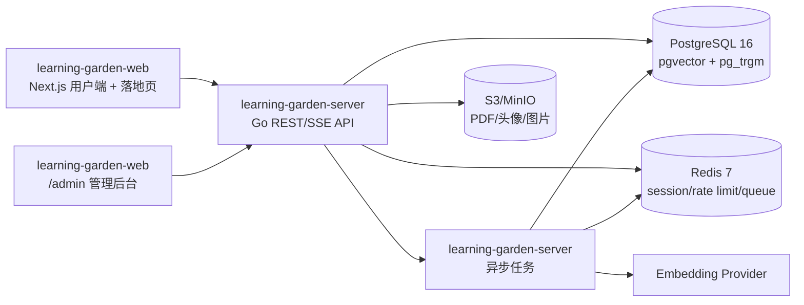

# Synapse 开发文档

## 1. 项目定位

Synapse 是面向 AI 学习者的结构化学习社区。核心不是普通笔记,而是把数学推导、可运行代码、论文引用放进同一套 Note/Block/Link 语义模型里,让个人学习轨迹可以被检索、复习、公开、评论、引用和派生。

当前原型包含这些主要界面:

- Marketing Landing: Hero、三类 Block、知识图谱演示、社区示例、工作流、Pricing、FAQ。
- Workspace: 个人学习首页、Roadmap、当前任务、最近 Note、复习提醒。
- Studio: 新建内容流程,包含标题、slug、标签、阶段、可见性、资源。
- Note Editor: PaperBlock、MathBlock、CodeBlock、跨块 Link、自动保存、历史版本、发布。
- Explore: Trending、Latest、Following、Tags、知识图谱、热门 Track。
- Profile: 用户主页、公开 Tracks/Notes/Papers/Graph、热力图、关注。
- Review: SM-2 风格复习卡片、Deck、到期队列、准确率。
- Auth: 注册/登录、OAuth 入口、密码强度、产品价值说明。
- Admin: 原型文档定义了后台管理、举报、注册闸门、审核策略、审计日志。

## 2. 核心业务模型

### 2.1 领域实体

| 实体                    | 用途                                                                                         |
| ----------------------- | -------------------------------------------------------------------------------------------- |
| User                    | 用户账号、角色、头像、bio、社交链接、可见性设置                                              |
| Track                   | 一条主题学习轨道,由多个 Note 组成                                                            |
| Note                    | 最小可分享学习单元,由多个 Block 组成                                                         |
| Block                   | 原子内容块,核心类型为 MathBlock、CodeBlock、PaperBlock                                       |
| Link                    | Block 之间的一等公民关系,支持 implements、derives_from、cites、contradicts、extends、related |
| ReviewCard              | 从 Block/Note 派生的复习卡,用于 SM-2 复习                                                    |
| Comment/Discussion      | 评论和树状讨论                                                                               |
| Follow/Like/Bookmark    | 社区互动和 Feed 来源                                                                         |
| Report/ModerationAction | 举报、审核、管理员审计                                                                       |
| Tag/Paper               | 主题标签和规范化论文元数据                                                                   |

### 2.2 产品主链路

1. 用户注册并进入 Workspace。
2. 用户创建 Track,按 Roadmap 推进学习。
3. 用户在 Studio/Editor 创建 Note。
4. Note 内插入 MathBlock、CodeBlock、PaperBlock。
5. 用户在 Block 或 Math step 之间建立 Link。
6. 保存草稿,发布为 private/unlisted/public。
7. public Note 触发 embedding worker,进入推荐、搜索和图谱。
8. 其他用户在 Explore/Profile/Graph 中浏览、关注、评论、引用。
9. 用户把关键 Block 派生为 ReviewCard,按 SM-2 复习。
10. 管理员处理举报、封禁、下架内容、调整注册策略。

## 3. 总体架构

项目采用前后端分仓架构:



`learning-garden-web` 只负责前端:Next.js 16 + React 19、页面、交互、前端路由、API client。`learning-garden-server` 负责后端:Go API、认证、数据库迁移、SQL 查询、Redis 会话、对象存储和后续 worker。不要把 `services/api`、Docker Compose、Go module 放进前端仓库。

## 4. 前端技术选型

### 4.1 基础栈

| 分类       | 选择                                               | 理由                                                   |
| ---------- | -------------------------------------------------- | ------------------------------------------------------ |
| 框架       | Next.js 16 App Router + React 19                   | 当前仓库已采用;落地页 SEO、SSR、RSC、路由和部署更直接  |
| 语言       | TypeScript strict                                  | 与复杂编辑器、API DTO、权限状态匹配                    |
| 包管理     | pnpm                                               | 当前仓库已锁定 pnpm 11                                 |
| 样式       | CSS Variables + Tailwind CSS + clsx/tailwind-merge | 原型依赖大量设计 token;Tailwind 适合应用界面提效       |
| UI 基础    | shadcn/ui + Radix UI                               | 表单、弹窗、菜单、Tabs、Accordion、Dialog 可访问性更稳 |
| 图标       | lucide-react                                       | 统一工具按钮和导航图标                                 |
| 服务端状态 | TanStack Query v5                                  | Note、Feed、评论、图谱等远程状态缓存和失效控制         |
| 本地状态   | Zustand                                            | 编辑器 UI 状态、草稿状态、命令面板                     |
| 表单校验   | react-hook-form + zod                              | Auth、Studio、Admin 表单可复用 schema                  |

### 4.2 关键功能库

| 功能       | 选择                                                              |
| ---------- | ----------------------------------------------------------------- |
| 块编辑器   | TipTap/ProseMirror + 自定义 NodeView                              |
| 代码编辑   | CodeMirror 6                                                      |
| 代码高亮   | Shiki                                                             |
| 数学渲染   | KaTeX                                                             |
| PDF 预览   | react-pdf/pdf.js                                                  |
| 知识图谱   | react-force-graph 或自研 Canvas force graph                       |
| 落地页粒子 | three.js 或当前 Canvas 粒子实现;复杂 3D 再引入 @react-three/fiber |
| 动画       | Framer Motion;GSAP 仅用于复杂时间轴                               |
| E2E        | Playwright                                                        |
| 组件测试   | Vitest + React Testing Library                                    |
| 可访问性   | axe-core                                                          |

### 4.3 前端目录建议

```text
app/
  (marketing)/
  (auth)/
  app/
    workspace/
    studio/
    notes/[slug]/
    explore/
    u/[handle]/
    review/
    settings/
  admin/
components/
  ui/
  landing/
features/
  auth/
  editor/
  graph/
  workspace/
  community/
  review/
  admin/
lib/
  api/
  auth/
  config/
  query/
  validators/
styles/
```

前端通过 `NEXT_PUBLIC_API_URL` 指向后端服务,本地默认是 `http://localhost:18080`。

## 5. 后端技术选型

### 5.1 基础栈

| 分类      | 选择                                     | 理由                                  |
| --------- | ---------------------------------------- | ------------------------------------- |
| 语言      | Go 1.22+                                 | 适合 API、后台任务、并发和长期维护    |
| Web 框架  | chi                                      | 轻量,贴近标准库,中间件组合清晰        |
| 数据访问  | sqlc + pgx                               | 类型安全 SQL,避免 ORM 黑盒            |
| 迁移      | golang-migrate                           | 简单稳定,适合 CI 和 Docker            |
| 数据库    | PostgreSQL 16                            | 主业务数据、全文/模糊搜索、事务一致性 |
| 向量检索  | pgvector                                 | Note/Block embedding 推荐和相似搜索   |
| 模糊搜索  | pg_trgm                                  | 搜索 Note、Paper、User、Tag           |
| 缓存/限流 | Redis 7 + go-redis/v9                    | token、限流、热点缓存、SSE 状态       |
| 任务队列  | asynq                                    | embedding、邮件、PDF 元数据、举报通知 |
| 认证      | JWT access + refresh cookie + Redis 吊销 | 用户体验和后台管控平衡                |
| 密码      | argon2id                                 | 注册登录安全基线                      |
| 对象存储  | MinIO 本地 + S3/R2 生产                  | PDF、头像、图片                       |
| 日志      | zerolog                                  | 结构化日志、低开销                    |
| 指标/追踪 | Prometheus + OpenTelemetry 接入点        | 线上问题定位                          |
| API 文档  | OpenAPI 3.1                              | 前后端协作、自动生成客户端类型        |

### 5.2 后端模块边界

以下结构位于 `learning-garden-server` 仓库:

```text
services/api/
  cmd/server
  cmd/worker
  internal/domain
  internal/repo
  internal/service
  internal/http
  internal/auth
  internal/editor
  internal/search
  internal/embedding
  internal/review
  internal/moderation
  internal/platform
  db/migrations
  db/queries
  api/openapi.yaml
```

### 5.3 API 风格

- 主体使用 REST。
- 通知和评论推送使用 SSE。
- 响应包络统一:

```json
{
  "data": {},
  "error": null,
  "meta": {}
}
```

- 错误码统一按 `code/message/details/requestId` 返回。
- 前端所有 mutating 请求带 CSRF header。
- 后台接口统一加 `/admin` 前缀并要求 `role in (moderator, admin)`。

## 6. 数据库设计重点

首批迁移至少包含:

- `users`: 账号、密码 hash、角色、状态、邮箱验证。
- `tracks`: owner、title、slug、summary、visibility、tags、stats。
- `notes`: track、owner、title、slug、visibility、status、content jsonb、plaintext、embedding、stats。
- `blocks`: note、kind、data jsonb、order_index、embedding。
- `block_links`: src/dst block、rel_type、note、created_by。
- `papers`: arXiv/DOI/title/authors/year/abstract/pdf_url/canonical_key。
- `review_cards`: block/note 来源、front/back、ease、interval、due_at、state。
- `comments` 和 `discussions`: 评论与树状讨论。
- `follows`、`likes`、`bookmarks`: 多态 target。
- `reports`: 举报队列。
- `moderation_actions`: 审计日志。
- `platform_settings`: 注册模式、限流策略、审核阈值。

关键索引:

- `notes(owner_id, status, updated_at desc)`
- `notes(visibility, published_at desc)`
- `notes using gin(plaintext gin_trgm_ops)`
- `notes using ivfflat(embedding vector_cosine_ops)`
- `blocks(note_id, order_index)`
- `blocks using ivfflat(embedding vector_cosine_ops)`
- `block_links(src_block_id)` 和 `block_links(dst_block_id)`
- `comments(target_type, target_id, created_at desc)`
- `review_cards(user_id, due_at, state)`

## 7. 开发顺序

### Phase 0: 仓库和运行基线

目标: 前后端独立启动。`learning-garden-web` 完成 Next.js 落地页和基础前端骨架;`learning-garden-server` 完成 Go 项目初始化、`/healthz`、Postgres/Redis/MinIO 本地依赖。

交付:

- `learning-garden-web`: 整理 Next.js 结构,补前端 `.env.example`。
- `learning-garden-server`: 新增 `services/api` Go 服务,提供 `/healthz`。
- `learning-garden-server`: 新增 Docker Compose: Postgres 16 + pgvector、Redis、MinIO。
- `learning-garden-server`: 新增 Makefile: `dev`、`api:dev`、`db:migrate`、`ci`。
- CI 分仓执行:前端跑 `pnpm typecheck && pnpm lint`;后端跑 `go test ./...`。

验收:

- 在 `learning-garden-web` 运行 `pnpm dev` 可打开落地页。
- 在 `learning-garden-server` 运行 `go run ./services/api/cmd/server` 可返回 `/healthz`。
- 在 `learning-garden-server` 运行 `docker compose up -d` 可启动依赖。

### Phase 1: 认证和用户基础

目标: 用户能注册、登录、刷新会话、访问个人身份。

交付:

- `learning-garden-server`: `users` 迁移和 sqlc queries。
- `learning-garden-server`: 注册、登录、刷新、退出、`/auth/me`。
- `learning-garden-server`: argon2id、access token、refresh cookie、Redis 吊销。
- `learning-garden-web`: Auth 页面接真实 API。
- `learning-garden-web`: 基础 Route Guard。

验收:

- 注册后可登录。
- 刷新页面仍保持会话。
- logout 后 refresh 失败。

### Phase 2: Track/Note/Block 数据闭环

目标: 编辑器暂时可以先用简化 UI,但数据模型必须真实。

交付:

- `tracks`、`notes`、`blocks`、`block_links`、`papers` 迁移。
- Track CRUD、Note CRUD、Block 物化保存。
- Note content 使用结构化 JSON,保存时同步 plaintext。
- 前端 Workspace/Studio/Note Editor 读取真实 Track/Note。
- Note visibility: private/unlisted/public。

验收:

- 创建 Track。
- 创建 Note 并保存三类 Block。
- 刷新后数据完整恢复。

### Phase 3: 核心编辑器

目标: 实现产品差异化的 Math/Code/Paper/Link。

交付:

- TipTap 编辑器基础。
- MathBlock: CodeMirror LaTeX 输入、KaTeX 预览、step anchor。
- CodeBlock: CodeMirror、多语言、复制代码、复制依赖。
- PaperBlock: arXiv/DOI 导入、quote、anchor。
- Link 创建弹窗: 搜索 Block/Note、选择 relation type、写注释。
- 自动保存: 1.5s 防抖、失败提示、历史版本快照。

验收:

- 一个 Note 中包含 PaperBlock、MathBlock、CodeBlock。
- Math step 可以 link 到 CodeBlock。
- hover link 显示对端预览。
- 发布前后 Link 不丢失。

### Phase 4: Explore、Profile 和知识图谱

目标: 公开内容可以被发现、浏览、关注和引用。

交付:

- Explore: Trending、Latest、Following、Tags。
- Note 阅读页: 目录、评论、Like、Bookmark、Share、Cites/Cited by。
- Profile: 用户资料、公开 Track、热力图、Block 分布。
- Graph: 个人图谱和全站图谱,节点为 Note,边为 Link 聚合。
- Trending 算法: 7 日内 `likes*3 + comments*2 + views`,按时间衰减。

验收:

- A 发布 public Note,B 在 Explore 能看到。
- B 关注 A 后 Following 出现 A 的新内容。
- 图谱能显示 Note 节点和 Link 边。

### Phase 5: Review 复习系统

目标: 从学习内容派生复习卡,形成长期学习闭环。

交付:

- `review_cards`、`review_logs` 迁移。
- 从 MathBlock/CodeBlock/PaperBlock 创建卡片。
- SM-2 简化算法: Again/Hard/Good/Easy 更新 ease、interval、due_at。
- Review 页面接真实 Deck、Due Queue、准确率统计。
- Workspace 显示今日 due 数。

验收:

- 用户可从 Block 创建复习卡。
- 到期卡进入 Review Queue。
- 自评后 due_at 正确变化。

### Phase 6: Embedding、搜索和推荐

目标: 让语义层产生实际推荐能力。

交付:

- public Note 发布后投递 asynq job。
- worker 计算 Note 和 Block embedding。
- pgvector 相似推荐接口。
- 搜索: keyword + tag + vector hybrid。
- Explore/Editor Link 弹窗使用搜索接口。

验收:

- 发布 public Note 后 worker 写入 embedding。
- Note 详情页展示相关 Note/Block。
- Link 弹窗能搜索到候选 Block。

### Phase 7: 社区互动和通知

目标: 完成社交闭环。

交付:

- Comment、Discussion、@mention。
- Follow、Like、Bookmark。
- Notification 表和 SSE `/events`。
- 邮件通知任务接口。
- 速率限制和新用户冷却规则。

验收:

- 评论触发通知。
- 前端不刷新可收到 SSE 红点。
- 受限用户触发限流提示。

### Phase 8: 管理后台和反滥用

目标: 平台可运营、可审核、可控注册。

交付:

- Admin 登录和角色校验。
- Dashboard KPI。
- 用户管理、内容管理、举报队列。
- 审核策略配置: 敏感词、自动隐藏阈值、新用户规则。
- registration_mode: open/invite_only/closed。
- moderation_actions 审计日志。

验收:

- 管理员可处理举报并下架内容。
- registration_mode=closed 时注册被拒绝。
- 每个管理动作可在审计日志查询。

### Phase 9: 安全、可观测性、文档和发布

目标: 达到可部署 MVP。

交付:

- CSRF double-submit。
- 登录/发帖/评论分级限流。
- 邮箱、token、密码日志脱敏。
- Prometheus `/metrics` 和 request id。
- OpenAPI 文档。
- README、architecture、api、admin guide、design system。
- Playwright E2E: 注册 -> 创建 Note -> 发布 -> 评论 -> 管理员处理举报。

验收:

- `make ci` 全部通过。
- 新机器 5 分钟内能跑起本地环境。
- Lighthouse: Landing Desktop >= 90、Accessibility >= 95。

## 8. 推荐开发原则

- 先打通真实数据闭环,再精修视觉细节。
- Note/Block/Link 是最高优先级,不要先把社区功能做满。
- 每个 Phase 结束必须有可演示链路。
- 后端先写迁移和 service 单测,再接 handler。
- 前端所有 API schema 用 zod 或生成类型约束。
- 编辑器复杂功能必须拆小: Block 渲染、Block 存储、Link 搜索、自动保存、历史版本分开做。
- 所有外部能力,包括 embedding、邮件、OAuth、对象存储,都必须通过环境变量配置。
- 任何 mock 都要可替换,并标明接口边界。

## 9. MVP 范围建议

MVP 必须包含:

- 登录注册。
- Workspace。
- Track/Note CRUD。
- MathBlock、CodeBlock、PaperBlock。
- Block Link。
- 发布和公开阅读页。
- Explore basic feed。
- Profile basic page。
- Review basic queue。
- Admin 举报处理最小闭环。

MVP 暂缓:

- Team/SSO。
- 复杂 OAuth 账号合并。
- Meilisearch。
- 实时代码沙箱运行。
- 高级 PDF 高亮同步。
- 复杂 Lottie 动效。
- 私有部署商业化配置。
